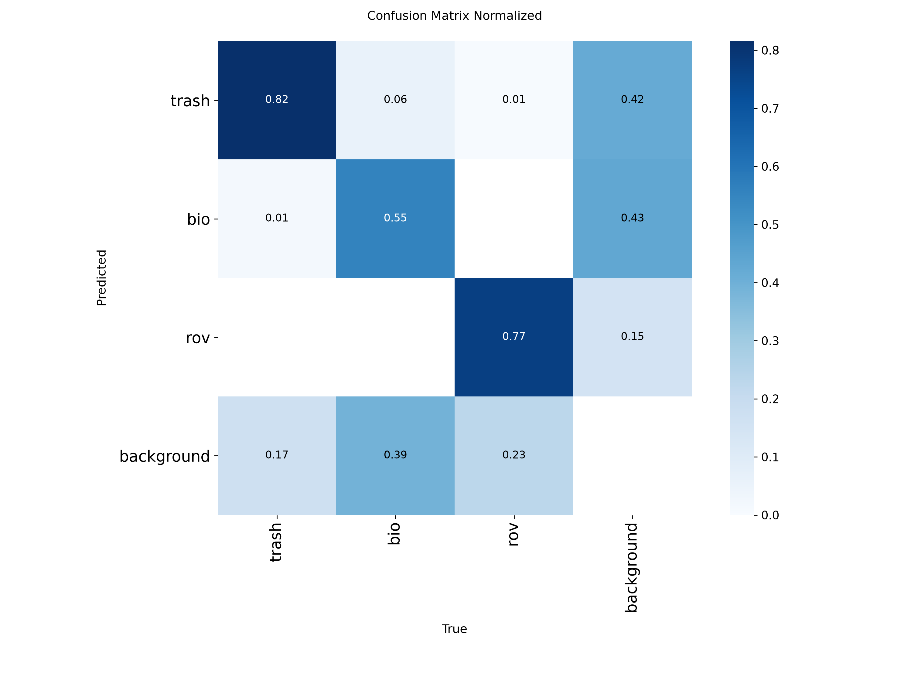
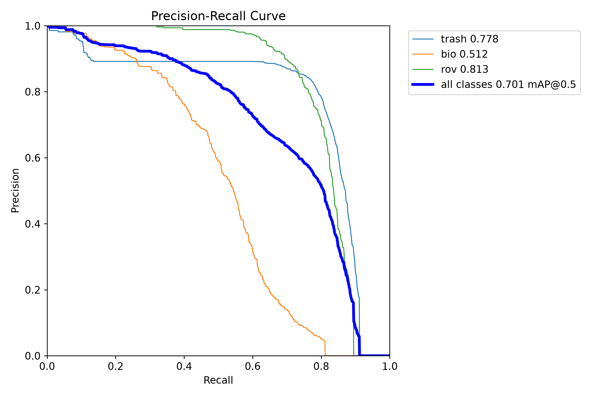
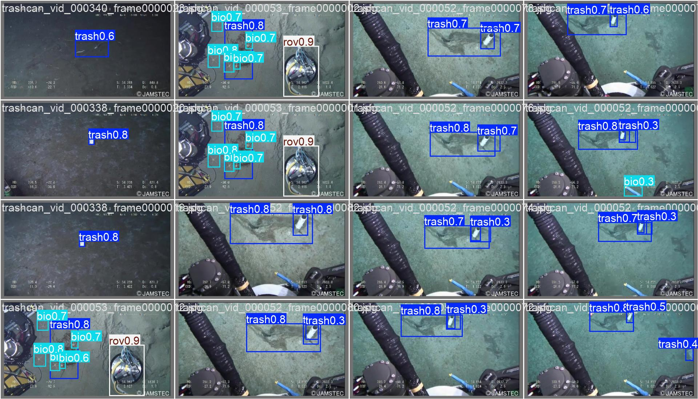

# 4. 评测与基准

## 测试集评测

```powershell
python scripts\eval_test.py      # 自动遍历 runs\*_trash，用 best.pt 在 test split 上 val
python scripts\eval_fine.py      # fine22 在其 val split 上
```

输出形如：

```
v5n_trash TEST P=0.9520 R=0.9480 mAP50=0.9820 mAP50-95=0.7920
```

分类别数字：加 `plots=True`（或在脚本里去掉该参数），ultralytics 会在 runs 目录写出分类别表、混淆矩阵与 PR 曲线：

| 图 | 位置 |
|---|---|
| 混淆矩阵 | `runs\<模型>\confusion_matrix_normalized.png` |
| PR 曲线 | `runs\<模型>\BoxPR_curve.png` |
| 检测样例 | `runs\<模型>\val_batch0_pred.jpg` |

v5n 的实测结果图（本仓库 Release 权重直接评出来的）：





## 推理延迟基准

```powershell
python scripts\bench_infer.py            # GPU
python scripts\bench_infer.py --device cpu
```

合成 640×640 帧、预热 5 帧后计 50 帧均值，输出 ms/帧 与 FPS。

## 复现基准表（README 里的数怎么来的）

| 步骤 | 命令 | 产物 |
|---|---|---|
| 训练 | `python scripts\train.py --model {v5n,v8n,v11n}` | `runs\*_trash` |
| 评测 | `python scripts\eval_test.py` | README 测试集表 |
| 延迟 | `python scripts\bench_infer.py` | README FPS 表 |

硬件参照：RTX 3050 Ti Laptop 4GB / torch 2.6.0+cu124 / ultralytics 8.4.x / Windows 11。不同硬件绝对值会变，**相对排序**（v8n 最快、三者精度持平）在同级硬件上稳定。

## 指标口径（重要，防止误读）

1. **test 与 val 不可直接比较**。unified 的 test split 只含 ICRA19 test 图像（TrashCAN 无 test 划分），目标偏大偏清晰；训练期 val 混入更难的 TrashCAN 图像。所以出现"val mAP50 ≈ 0.66-0.70、test mAP50 ≈ 0.98"是数据构成差异，不是模型波动。
2. **延迟基准用合成帧**，只衡量模型前向耗时，不含摄像头采集与画图开销；实时演示的端到端帧率会低一些。
3. mAP@0.5:0.95 对小目标严格得多，深海小目标场景 0.79 已属高位，不要与 COCO 大目标成绩直接类比。

## 想做跨数据集泛化实验？

保留各数据集原生划分的另一个用途：把 A 数据集训的模型放到 B 数据集同名类别上评 val，可以定量看到域差异（例如深海 → 近岸）。`eval_test.py` 改一下 `data=` 指向另一个 yaml 即可。这是个不错的课程作业/毕设扩展方向。
